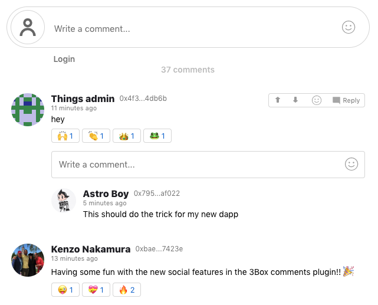

[](https://discordapp.com/invite/Z3f3Cxy)
[](https://www.npmjs.com/package/3box-comments-react)
[](https://twitter.com/3boxdb)

# 3Box Comments Plugin 💬

`3box-comments-react` node package is a drop-in react component that provides Web3 developers with a readymade commenting system for their Ethereum application. Easily add rich, decentralized social discourse to your dApp with one line of code. The 3Box Comments plugin is built using 3Box infrastructure, and handles all logic for creating a comments thread. *Read the docs on [docs.3box.io](https://docs.3box.io/build/plugins/comments)*.

### Try the demo [here](https://3box.github.io/3box-comments-react/examples/dist/)

</br>

## How it Works
#### Architecture
The Comments plugin is built using a standard implementation of [Open Threads](https://docs.3box.io/build/web-apps/messaging/choose#open-threads) which are defined in the [3Box Threads API](https://docs.3box.io/api/messaging) and made available via the [`3Box.js SDK`](https://github.com/3box/3box-js). The Comments plugin also includes UI for inputting and displaying user comments, logic for fetching user profiles, and pagination. The component is configurable to various authentication patterns, and can handle both Web3/3Box logged-in & logged-out states. 

#### Authentication
Without authenticating, users can read messages in the comment thread. However authentication is required to perform more interactive functionality. After the user is authenticated, a user can post a comment, delete their comment, and receive comments from other users in *real-time*.
</br>
</br>

## Getting Started
1. Install the component
2. Choose your authentication pattern
3. Configure application settings
4. Usage

### 1. Install the component

```shell
npm i -S 3box-comments-react
```

### 2. Choose your authentication pattern
Depending on *when and how* your dApp handles authentication for web3 and 3Box, you will need to provide a different set of props to the component. Three acceptable authentication patterns and their respective props are discussed below in A-C:

**A) Dapp handles web3 and 3Box logins, and they run *before* component is mounted. (recommended)**

Dapp integrates with `3Box.js SDK` and the `3box-comments-react` component. In this case, the `box` instance returned from `Box.openBox(ethAddr)` via 3Box.js should be passed to the `box` prop in the comments component. The user's current Ethereum address should be passed to the `currentUserAddr` prop to determine `deletePost` access on each comment.

**B) Dapp handles web3 and 3Box logins, but they haven't run before component is mounted. (recommended)**

Dapp integrates with `3Box.js SDK` and the `3box-comments-react` component. In this case, the login logic implemented in the dapp should be passed to the Comments component as the `loginFunction` prop, which is run when a user attempts to post a comment. The user's current Ethereum address should be passed to the `currentUserAddr` prop to determine `deletePost` access on each comment.

**C) Dapp has no web3 and 3Box login logic.**

Dapp only integrates with the `3box-comments-react` component, but not `3Box.js SDK`. All web3 and 3Box login logic will be handled within the Comments component, though it's required for the `ethereum` object from your dapp's preferred web3 provider be passed to the `ethereum` prop in the component.

#### Best practice

For the best UX, we recommend implementing one of the following authentication patterns: A; B; or B with A.

Each of these patterns allow your application to make the `box` object available in global application state where it can be used by all instances of the Comments component regardless of which page the user is on. This global pattern removes the need for users to authenticate on each individual page they wish to comment on, which would be the case in C.

### 3. Configure application settings

**First, choose a name for your application's 3Box space.**

Although you are free to choose whichever name you'd like for your app's space, we recommend using the name of your app. If your application already has a 3Box space, you are welcome to use that same one for comments.

**Next, choose a naming convention for your application's threads.**

Comment threads need a name, and we recommend that your application creates `threadNames` according to a simple rule. We generally like using a natural identifier, such as community name, page URL, token ID, or other similar means.

**Then, create an admin 3Box account for your application.**

Each thread is required to have an admin (`adminEthAddr`), which possesses the rights to moderate the thread. We recommend you create an admin Ethereum account for your application so you can perform these actions. While technically you can use any Ethereum address as an admin account, we recommend [creating a 3Box profile](https://3box.io/hub) for that address so if you need to take action in the thread, others will know and trust you as the admin.

**Lastly, initialize your application's space.**

Before threads can be deployed in your dapp, your application's admin account (`adminEthAddr` created in the previous step) must first open the space (`spaceName`) that will be used to store your application's threads. This step *must* be completed before your comment threads can be used by others. This process would likely be done outside the context of your dapp, probably in a test environment.

Simply open a space by running (via `3Box.js SDK`): 
```
const box = await Box.openBox(adminEthAddr, ethereum);
const space = await box.openSpace(spaceName, spaceOpts);
```
Sign the web3 prompts to complete the space initialization process.
</br>
</br>


### 4. Usage

#### Example

```jsx
import ThreeBoxComments from '3box-comments-react';

const MyComponent = ({ handleLogin, box, ethereum, myAddress, currentUser3BoxProfile, adminEthAddr }) => (
    <ThreeBoxComments 
        // required
        spaceName="mySpaceName"
        threadName="myThreadName"
        adminEthAddr={adminEthAddr}


        // Required props for context A) & B)
        box={box}
        currentUserAddr={myAddress}

        // Required prop for context B)
        loginFunction={handleLogin}

        // Required prop for context C)
        ethereum={ethereum}

        // optional
        members={false}
        showCommentCount={10}
        threadOpts={{}}
        useHovers={false}
        currentUser3BoxProfile={currentUser3BoxProfile}
        userProfileURL={address => `https://mywebsite.com/user/${address}`}
    />
);
```


#### Prop Types

| Property | Type          | Default  | Required Case          | Description |
| :-------------------------------- | :-------------------------------------------------------- | :------------------------------------------------------------------------------------------------------------- | :------------------------------------------------------ | :--------------------------------------------------------------------------------------------------------------------------------------------------------------------------------------------------------------------------------------------------------------------------------------------------------------------------------------------------------------------------------------------------------------- |
| `spaceName`    | String        |    |  Always   | Likely your dApp name and / or comment category.  A single `spaceName` with different `threadName`s is common practice when building a dApp with multiple Comment threads. |
| `threadName`    | String       |   | Always    | A name specific to this Comments thread. |
| `adminEthAddr`    | String (Ethereum Address)       |   | Always    | The Ethereum address you wish to give admin rights to for the Comments thread.  This user will be able to delete all comments and accept members in a members-only thread. **A thread with a new admin address, despite identical `spaceName` and `threadName`, will create an entirely new thread.**|
| `box`    | Object         |   | A (and likely B)    | The `box` instance returned from running `await Box.openBox(address, web3)` somewhere in your dApp.|
| `currentUserAddr`    | String (Ethereum Address)          |    | A & B | The current user's Ethereum address. Passing this will help determine whether a user has delete access on each comment.  This prop will also let the component fetch that user's 3Box profile on component mount and render that data (profile picture) in the Comment input UI. |
| `loginFunction`    | Function       |    | B    | A function from your dApp that handles web3 and 3Box login at the global dApp state. This callback will run when a user attempts to save a comment but a `box` instance doesn't yet exist. Running this function should result in a box instance (from `const box = Box.openBox(address, web3)`) being passed as the `box` prop to this component.  |
| `ethereum`    | Object        |  window.ethereum  | C    | The `ethereum` object from whichever web3 provider your dApp uses.  The `enable` method on this object will be used to get the current user's Ethereum address and that address will be used to `openBox` within the current Component context.|
| `members`    | Boolean       |  False   | Optional    | A boolean - `true` - to make the thread a members-only thread. Passing `false` will allow all users to post to the thread.  **Changing this setting after creating it will result in an entirely different thread** (see [Docs.3box.io](https://Docs.3box.io) for more info). |
| `showCommentCount`    | Integer       |  30   | Optional    | The number of comments rendered in the UI by default on component mount and the number of additional comments revealed after clicking `Load more` in component. |
| `spaceOpts`    | Object       | | Optional    | Optional parameters for threads (see [Docs.3box.io](https://Docs.3box.io) for more info)|
| `threadOpts`    | Object       | | Optional    | Optional parameters for threads (see [Docs.3box.io](https://Docs.3box.io) for more info)|
| `useHovers`    | Boolean       |  False  | Optional    | Pass true to enable a 3Box profile pop up when hovering over a commenter's name |
| `currentUser3BoxProfile`    | Object       |   | Optional    | If the current user has already had their 3Box data fetched at the global dApp state, pass the object returned from `Box.getProfile(profileAddress)` to avoid an extra request.  This data will be rendered in the Comment input interface.|
| `userProfileURL`    | Function       |  Defaults to returning user's 3Box profile URL  | Optional    | A function that returns a correctly formatted URL of a user's profile on the current platform.  The function will be passed an Ethereum address within the component, if needed.  A user will be redirected to the URL returned from this function when clicking on the name or Ethereum address associated with the comment in the thread.|

## License

MIT
